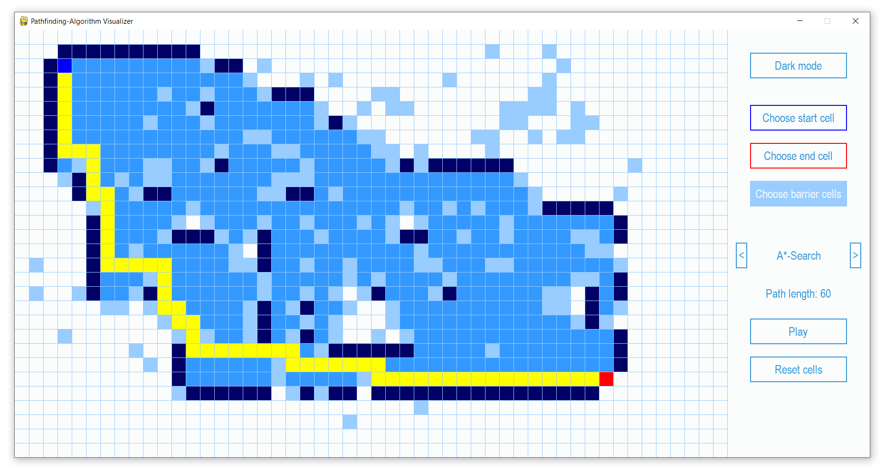
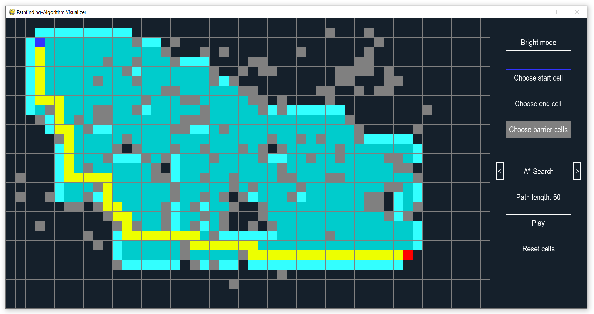

# Pathfinding Algorithms Visualizer

All algorithms are implemented as Graph Search, i.e., already visited spots will not be considered again.

## Uninformed (using no heuristics) search algorithms:
* [Breadth-First-Search](https://github.com/mrk-drn/pathfinding-algorithms-visualizer/blob/master/breadth_first_graphsearch.py)
* [Depth-First-Search](https://github.com/mrk-drn/pathfinding-algorithms-visualizer/blob/master/depth_first_graphsearch.py)
* [Uniform-Cost-Search (Dijkstra)](https://github.com/mrk-drn/pathfinding-algorithms-visualizer/blob/master/uniform_cost_graphsearch.py)

## Informed (using heuristics) search algorithms:
* [Greedy-Best-First-Search](https://github.com/mrk-drn/pathfinding-algorithms-visualizer/blob/master/greedy_best_first_graphsearch.py)
* [A*-Search](https://github.com/mrk-drn/pathfinding-algorithms-visualizer/blob/master/astar_graphsearch.py)

The heuristic used here is the L-distance, i.e., abs(x_cell - x_goal) + abs(y_cell - y_goal). It can be easily seen that this heuristic satisfies the following triangle inequality:

&nbsp;&nbsp;&nbsp;&nbsp;&nbsp;&nbsp;&nbsp;&nbsp;&nbsp;&nbsp;&nbsp;&nbsp;&nbsp;&nbsp;&nbsp;&nbsp;&nbsp;&nbsp;&nbsp;&nbsp;&nbsp;&nbsp;&nbsp;&nbsp;&nbsp;&nbsp;&nbsp;&nbsp;&nbsp;&nbsp;&nbsp;&nbsp;&nbsp;&nbsp;&nbsp;&nbsp;&nbsp;&nbsp;&nbsp;&nbsp;&nbsp;&nbsp;&nbsp;&nbsp;&nbsp;&nbsp;&nbsp;&nbsp;&nbsp;&nbsp;&nbsp;&nbsp;&nbsp;&nbsp;&nbsp;&nbsp;&nbsp;&nbsp;&nbsp;&nbsp;&nbsp;&nbsp;&nbsp;&nbsp; heuristic(cell) <= costs(cell, cell') + heuristic(cell'),
			
where cell' is a neighbour of cell and costs(cell, cell') are the costs to get from cell to cell' (which is 
always 1). Thus, the heuristic is "consistent" which is the requirement for A*-Graph-Search to be optimal, i.e., to always find the shortest solution path (if a solution path exists).

 
